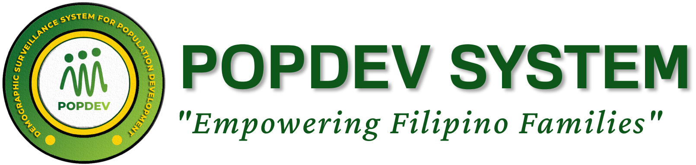

<!-- Improved compatibility of back to top link: See: https://github.com/othneildrew/Best-README-Template/pull/73 -->
<a name="readme-top"></a>
<!--
*** Thanks for checking out the Best-README-Template. If you have a suggestion
*** that would make this better, please fork the repo and create a pull request
*** or simply open an issue with the tag "enhancement".
*** Don't forget to give the project a star!
*** Thanks again! Now go create something AMAZING! :D
-->


<!-- PROJECT SHIELDS -->
<!--
*** I'm using markdown "reference style" links for readability.
*** Reference links are enclosed in brackets [ ] instead of parentheses ( ).
*** See the bottom of this document for the declaration of the reference variables
*** for contributors-url, forks-url, etc. This is an optional, concise syntax you may use.
*** https://www.markdownguide.org/basic-syntax/#reference-style-links
-->


<!-- PROJECT LOGO -->
<br />
<div align="center">
  <a href="https://github.com/othneildrew/Best-README-Template">
    
  </a>

  <h3 align="center">Population Development System with Extensive Data Analytics and Integrations for the Commission on Population and Development</h3>

  <p align="center">
    A census web application for the admins, LGU, Barangays and enumerators of Population Development!
    <br />
    <br />
    <br />
    <a href="https://popdev.online">View Demo</a>
    ·
    <a href="https://github.com/othneildrew/Best-README-Template/issues">Report Bug</a>
    ·
    <a href="https://github.com/othneildrew/Best-README-Template/issues">Request Feature</a>
  </p>
</div>


<!-- TABLE OF CONTENTS -->
<details>
  <summary>Table of Contents</summary>
  <ol>
    <li>
      <a href="#about-the-project">About The Project</a>
      <ul>
        <li><a href="#built-with">Built With</a></li>
      </ul>
    </li>
    <li>
      <a href="#getting-started">Getting Started</a>
      <ul>
        <li><a href="#prerequisites">Prerequisites</a></li>
        <li><a href="#installation">Installation</a></li>
      </ul>
    </li>
    <li><a href="#usage">Usage</a></li>
    <li><a href="#contact">Contact</a></li>
  </ol>
</details>


<!-- ABOUT THE PROJECT -->
## About The Project


Introducing the Popdev System, an advanced census system designed exclusively for the Commission on Population and Development (POPCOM) of the Government of the Philippines. This cutting-edge system is specifically tailored to meet the unique needs of POPCOM, enabling efficient population data collection, analysis, and reporting for evidence-based policy development and strategic planning.

The Popdev System offers a user-friendly interface, ensuring a seamless user experience for POPCOM and its various sectors. With its intuitive design and streamlined workflows, users can easily navigate through the system and access its powerful features.

At the core of the Popdev System is its robust data collection module. This module allows users to gather comprehensive information about the population, including demographic details such as age, gender, ethnicity, education, occupation, and income levels. The system employs sophisticated data validation techniques to ensure accuracy and reliability, reducing errors and improving data quality.

One of the standout features of the Popdev System is its advanced data export capabilities. Users can effortlessly generate reports and export data in multiple formats, including Excel, CSV, and PDF. This feature enables seamless data sharing and collaboration with different government sectors, facilitating informed decision-making and fostering interdepartmental cooperation.

Data analytics is a crucial aspect of the Popdev System, providing powerful tools for comprehensive analysis. Users can harness the system's advanced analytics features to uncover valuable insights and trends within the population data. The system's robust visualization capabilities, including charts, graphs, and maps, facilitate data interpretation and presentation, empowering POPCOM to communicate key findings effectively.

Security and privacy are paramount in the Popdev System. Stringent data protection measures are implemented, including industry-standard encryption protocols, access controls, and data anonymization techniques. The system adheres to relevant data protection regulations, ensuring the confidentiality and integrity of sensitive information.

The Popdev System stands as a comprehensive solution, supporting POPCOM's mission to promote sustainable population development in the Philippines. With its user-friendly interface, comprehensive data analytics, and emphasis on data security, the system equips POPCOM and its sectors with the necessary tools to make informed decisions, develop evidence-based policies, and drive positive change for the population.

<p align="right">(<a href="#readme-top">back to top</a>)</p>


### Built With

This section should list any major frameworks/libraries used to bootstrap your project. Leave any add-ons/plugins for the acknowledgements section. Here are a few examples.

* [![Laravel][Laravel.com]][Laravel-url]
* [![Bootstrap][Bootstrap.com]][Bootstrap-url]
* [![JQuery][JQuery.com]][JQuery-url]

<p align="right">(<a href="#readme-top">back to top</a>)</p>


<!-- GETTING STARTED -->
## Getting Started

To set up your Laravel project locally, follow these simple steps:

### Prerequisites

PHP: Make sure you have PHP installed on your machine. You can download the latest version of PHP from the official PHP website (https://www.php.net/) and follow the installation instructions for your specific operating system.

Composer: Install Composer, a dependency management tool for PHP, on your local machine. You can download Composer from the official website (https://getcomposer.org/) and follow the installation instructions.

Laravel: Ensure you have Laravel installed globally on your system. Open a command-line interface (CLI) and run the following command:

 ```sh
    composer global require laravel/installer
   ```

### Installation

Follow these steps to install and set up your Laravel project:
Clone the repository:

 ```sh
    git clone https://github.com/ccmanganti/popdev-census.git
   ```

Install dependencies:

 ```sh
    cd project-name
    composer install
   ```

Set up the environment:
```sh
    php artisan key:generate
   ```

Database configuration:

In the .env file, update the database connection settings according to your local environment. Set the database name, username, and password.

Run database migrations:

```sh
    php artisan migrate
   ```

Serve the application:
```sh
    php artisan serve
   ```
<p align="right">(<a href="#readme-top">back to top</a>)</p>


<!-- USAGE EXAMPLES -->
## Usage

Usage Description:

The Popdev System is a comprehensive census system designed for the Commission on Population and Development (POPCOM) of the Government of the Philippines. This user-friendly system offers a range of functionalities to assist POPCOM and its various sectors in gathering, managing, analyzing, and utilizing population data for informed decision-making and policy development.

Here's an overview of the system's key functionalities and how it can be used:

1. Data Collection:
- Capture Demographic Information: The system allows users to collect essential demographic details such as age, gender, ethnicity, education, occupation, and income levels of the population.
- Streamlined Data Entry: Users can input data through intuitive forms, ensuring accuracy and efficiency in the data collection process.
- Validation and Error Handling: The system employs data validation techniques to minimize errors and ensure the integrity of collected data.

2. Data Management:
- Secure Storage: The system securely stores collected data, following industry-standard protocols for data security and privacy.
- Search and Retrieval: Users can easily search and retrieve specific population data based on various parameters, enabling quick access to relevant information.
- Data Updates: The system supports the ability to update population data as necessary, ensuring the data remains up-to-date.

3. Data Analytics:
- Comprehensive Analysis: Users can leverage advanced data analytics features to gain insights into population dynamics, trends, and patterns.
- Visualization: The system provides powerful visualization tools, including charts, graphs, and maps, to present analyzed data in a clear and visually appealing manner.
- Reporting: Users can generate comprehensive reports based on analyzed data, facilitating evidence-based decision-making and policy formulation.

4. Data Export and Sharing:
- Export Data: The system offers flexible options to export population data in various formats, such as Excel, CSV, or PDF, facilitating data sharing and collaboration with different government sectors.
- Interdepartmental Cooperation: The system promotes seamless data sharing and collaboration among different sectors within the government, ensuring cross-functional utilization of population data.

5. Security and Privacy:
- Data Protection: The system incorporates robust security measures to protect sensitive population data, adhering to industry-standard encryption protocols and access controls.
- Confidentiality: The system maintains user confidentiality by anonymizing personal information and adhering to relevant data protection regulations.

The Popdev System serves as a vital tool for POPCOM and its sectors to effectively gather, manage, analyze, and utilize population data. By providing a user-friendly interface, comprehensive analytics capabilities, and robust data security, the system enables POPCOM to make data-driven decisions, develop evidence-based policies, and drive positive population development in the Philippines.

<p align="right">(<a href="#readme-top">back to top</a>)</p>


<!-- CONTACT -->
## Contact

Your Name - [@ccmanganti](https://facebook.com/ccmanganti) - cpe.christopherclarkcmanganti@gmail.com

Project Link: [https://github.com/ccmanganti/popdev-census](https://github.com/ccmanganti/popdev-census)

<p align="right">(<a href="#readme-top">back to top</a>)</p>


<!-- MARKDOWN LINKS & IMAGES -->
<!-- https://www.markdownguide.org/basic-syntax/#reference-style-links -->
[contributors-shield]: https://img.shields.io/github/contributors/othneildrew/Best-README-Template.svg?style=for-the-badge
[contributors-url]: https://github.com/othneildrew/Best-README-Template/graphs/contributors
[forks-shield]: https://img.shields.io/github/forks/othneildrew/Best-README-Template.svg?style=for-the-badge
[forks-url]: https://github.com/othneildrew/Best-README-Template/network/members
[stars-shield]: https://img.shields.io/github/stars/othneildrew/Best-README-Template.svg?style=for-the-badge
[stars-url]: https://github.com/othneildrew/Best-README-Template/stargazers
[issues-shield]: https://img.shields.io/github/issues/othneildrew/Best-README-Template.svg?style=for-the-badge
[issues-url]: https://github.com/othneildrew/Best-README-Template/issues
[license-shield]: https://img.shields.io/github/license/othneildrew/Best-README-Template.svg?style=for-the-badge
[license-url]: https://github.com/othneildrew/Best-README-Template/blob/master/LICENSE.txt
[linkedin-shield]: https://img.shields.io/badge/-LinkedIn-black.svg?style=for-the-badge&logo=linkedin&colorB=555
[linkedin-url]: https://linkedin.com/in/othneildrew
[product-screenshot]: images/screenshot.png
[Next.js]: https://img.shields.io/badge/next.js-000000?style=for-the-badge&logo=nextdotjs&logoColor=white
[Next-url]: https://nextjs.org/
[React.js]: https://img.shields.io/badge/React-20232A?style=for-the-badge&logo=react&logoColor=61DAFB
[React-url]: https://reactjs.org/
[Vue.js]: https://img.shields.io/badge/Vue.js-35495E?style=for-the-badge&logo=vuedotjs&logoColor=4FC08D
[Vue-url]: https://vuejs.org/
[Angular.io]: https://img.shields.io/badge/Angular-DD0031?style=for-the-badge&logo=angular&logoColor=white
[Angular-url]: https://angular.io/
[Svelte.dev]: https://img.shields.io/badge/Svelte-4A4A55?style=for-the-badge&logo=svelte&logoColor=FF3E00
[Svelte-url]: https://svelte.dev/
[Laravel.com]: https://img.shields.io/badge/Laravel-FF2D20?style=for-the-badge&logo=laravel&logoColor=white
[Laravel-url]: https://laravel.com
[Bootstrap.com]: https://img.shields.io/badge/Bootstrap-563D7C?style=for-the-badge&logo=bootstrap&logoColor=white
[Bootstrap-url]: https://getbootstrap.com
[JQuery.com]: https://img.shields.io/badge/jQuery-0769AD?style=for-the-badge&logo=jquery&logoColor=white
[JQuery-url]: https://jquery.com 
